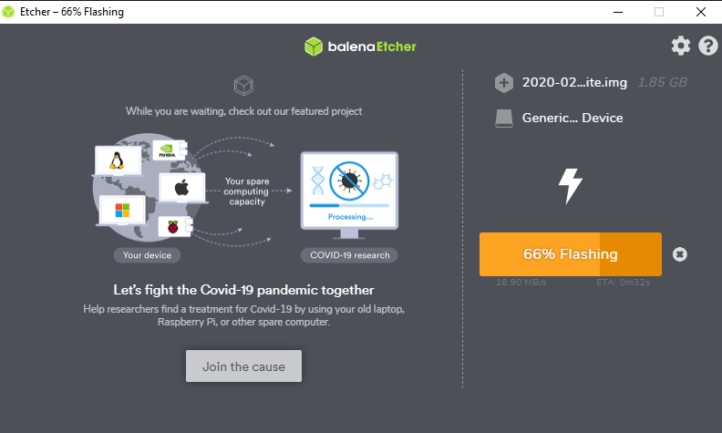
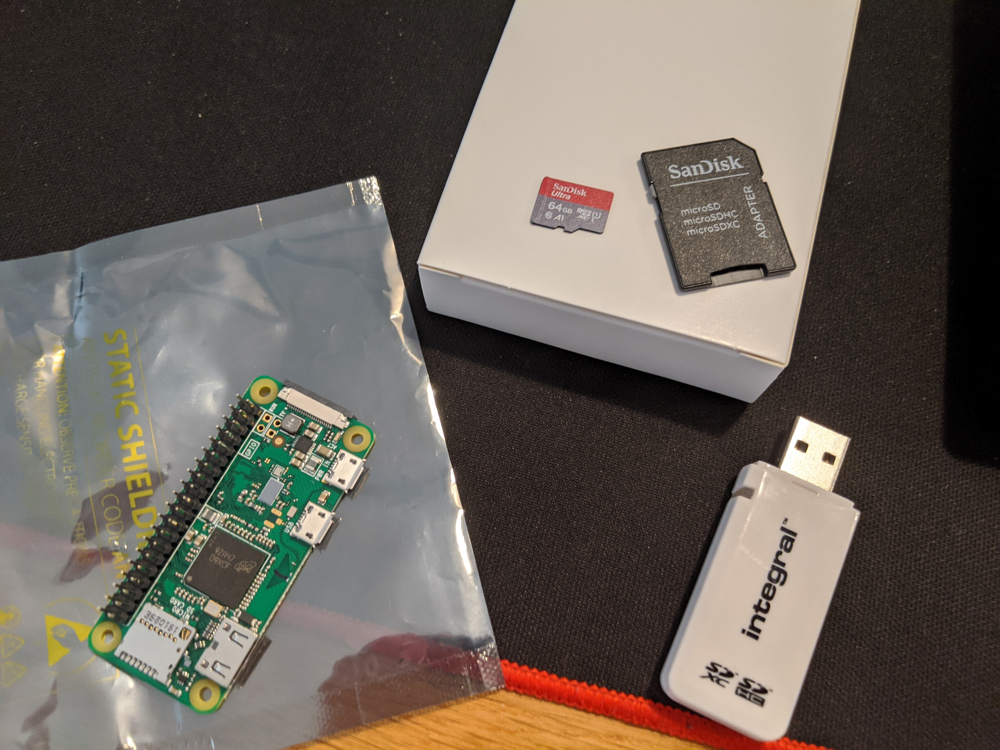
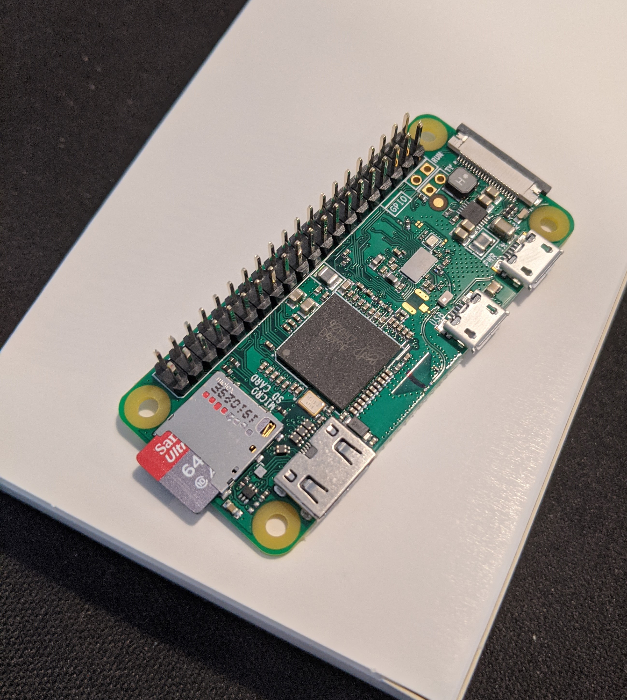

# 1. Download an 'Etcher' write a OS image to the SD card used by the pi

[Instructions link](https://www.raspberrypi.org/documentation/installation/installing-images/)

https://www.balena.io/etcher/

> [balenaEtcher](./balenaEtcher-Portable-1.5.81.exe)

# 2. Download an OS image

[Raspbian downloads link](https://www.raspberrypi.org/downloads/raspbian/)

> [Raspian buster lite image](./2020-02-13-raspbian-buster-lite/2020-02-13-raspbian-buster-lite.img)

# 3. Flash img to SDCArd

Flashing img using Balena:


# 4. Install SD Card and connect to Raspberry pi

SD Card and Raspberry pi:


SD Card installed: 


# 4.a enable wifi and ssh before booting by modifying the SDcard directly

[Instructions on Supplicant wifi](https://core-electronics.com.au/tutorials/raspberry-pi-zerow-headless-wifi-setup.html)

1. create *wpa_supplicant.conf* with wifi details
```
country=GB
ctrl_interface=DIR=/var/run/wpa_supplicant GROUP=netdev
update_config=1
network={
	ssid="MyWiFiNetwork"
	psk="aVeryStrongPassword"
	key_mgmt=WPA-PSK
}
```
2. create an empty file called *ssh* to enable ssh

# 5. Boot raspberry pi

Default username
> pi

Default password
> raspberry

Go to router and check if the raspberrypi have connected to the network via wifi. For multiple raspberrypis, use the ip address of the new pi.

ssh into raspberry
> ssh pi@raspberrypi

# 6. Configure your rasperry

[raspi-config](https://www.raspberrypi.org/documentation/configuration/raspi-config.md)

Run raspberry config
> sudo raspi-config

Things to do: 
1. change default pi passowrd
2. change hostname